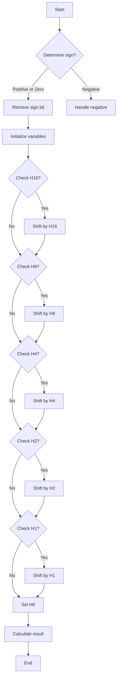

# 测试方法
```shell
./dlc bits.c //检查ops师傅符合要求

make btest

./btest //测试
```

# 完成bits.c中的函数

## bitXor
计算异或值，根据异或的定义相同为0，相异为1得：
|x|y|xor|
|----|----|----|
|0|1|1|
|1|0|1|
|0|0|0|
|1|1|0|

```c
x^y= ~x&y | x&~y
    = ~(~(~x&y | x&~y))
    = ~(~(~x&y) & ~(x&~y))
```

```c
int bitXor(int x, int y)
{
    return ~(~(~x&y) & ~(x&~y));
}
```
## tmin
有符号数的范围：
- 最大值: 0b0111 1111 ......
- 最小值：0b1000 0000 ......

可以发现`Tmin = Tmax + 1`

```c
int tmin(void)
{
    return 0x80000000;
}
// 直接这样是不行的
```
`dlc:bits.c:168:tmin: Illegal constant (0xFFFFFFFF) (only 0x0 - 0xff allowed)`

```c
int tmin(void)
{
    return (1 << 31);
}
```
## isTmax

上面得到一个规律：`Tmin = Tmax + 1`
还可以发现：`~Tmax = Tmin`

综合可知：`~Tmax = Tmax + 1`

```c
int isTmax(int x)
{
    return !((x + 1) ^ (~x));
}
```
测试发现：
`ERROR: Test isTmax(-1[0xffffffff]) failed...
...Gives 1[0x1]. Should be 0[0x0]`
当x = -1 = 0xffffffff时，~x = 0x0，x+1 = 0x0，也满足上述条件。所以还需要加上符号位的判断：
```c
int isTmax(int x)
{
    return !((x + 1) ^ (~x)) & !(x >> 31);
}
```

## addOddBits

看奇数bit位上是否是1

(x & 0xAAAAAAAA) == 0xAAAAAAAA

```c
int allOddBits(int x)
{
    int mask = 0xAA + (0xAA << 8);
    mask |= mask << 16;
    return !((mask & x) ^ mask);
}
```
## negate

求相反数 = x取反 + 1

```c
int negate(int x)
{
    return ~x + 1;
}
```

## isAsciiDigit
判断数是否在0x30到0x39之间，等价为
```c
(x - 0x30) * (0x39 - x) >= 0
```
进一步意味着`(x - 0x30)`和`(0x39 - x)`的符号位都是0

```c
int isAsciiDigit(int x)
{
    int res1 = (x + (~0x30 + 1)) >> 31;
    int res2 = (0x39 + (~x + 1)) >> 31;
    return !(res1 | res2);
}
```

## conditional
x != 0 返回y, 否则返回z


**重点就是如何将x==0转换为flag = 0xffffffff, x!= 0转换为flag = 0x0**
- 首先将这两种情况分开：
```c
int flag = !!x;//x =0,flag = 0, x!=0,flag = 1
```
- 0和1如何变为全0和全1？

return (a & y) | (b & y);

 |flag|a|b|
 |----|----|----|
 |0|0x0|0xffffffff|
 |1|0xffffffff|0x0|

- flag = 0, flag - 1 = ~flag = 0xffffffff
- flag = 1, flag - 1 = 0x0

可以看出: b = flag - 1
```c
int conditional(int x, int y, int z)
{
    int flag = !!x;   // x =0,flag = 0, x!=0,flag = 1
    return (~((flag - 1)) & y) | ((flag - 1) & z);
}
```

## isLessOrEqual
怎么用位运算判断两个数的大小？

x <= y 等价于 y - x >=0

和isAsciiDigit一个思路
```c
int isLessOrEqual(int x, int y)
{
    return !((y + (~x + 1)) >> 31);
}
```

**note：**

在另一台电脑上这个解法会有溢出的情况，比如：
- 上溢：一个正数减去一个负数，结果超过Tmax,就会变成负数。
- 下溢：一个负数减去一个正数，结果小于Tmin，就会变成正数。
> 当我们进行有符号数的计算时，如果 最高位 和 次高位 产生的进位数异或结果为1，那么就发生了溢出
> 补充：无符号数会有回绕

如果考虑溢出的情况，采用分类讨论：
1. x >= 0, y >= 0, y - x >=0 
2. x < 0, y < 0, y - x >= 0
3. x >= 0, y < 0, y - x < 0, return 0
4. x < 0, y >= 0, y - x >= 0, return 1

- 1-2情况：signx ^ signy = 0 且 y + (~x + 1) = 0
- 3-4情况： signx & !signy

```c
int isLessOrEqual(int x, int y)
{
    int signx = (x >> 31) & 0x1;
    int signy = (y >> 31) & 0x1;
    int flag  = (y + (~x + 1)) >> 31;
    int c1    = signx & !signy;   // x <0 & y>=0
    // int c2    = !signx & signy;   // x >=0 & y<0
    return c1 | (!(signx ^ signy) & !flag);
}
```

## logicalNeg
x != 0 返回 0；等于0 返回1

0的性质：~x = x - 1

```c
int logicalNeg(int x)
{
    // x = 0,返回1，非0返回0
    return !(~x ^ (x - 1));
}
```
结果：`ERROR: Test logicalNeg(-2147483648[0x80000000]) failed...
...Gives 1[0x1]. Should be 0[0x0]`

还漏了一个值0x80000000 Tmin也满足上述情况，所以还需要加上符号位的判断：
```c
int logicalNeg(int x){
    return !(~x ^ (x - 1)) & !(x >> 31);
}
```
## howManyBits
统计表示这个数需要的最少位数 = 符号位 + 数据位

用二分法：
```c
int howManyBits(int x)
{
    int sign = (x >> 31);                   // x < 0,sign = 0x0, x >= 0,sign = 0xffffffff
    x        = (~sign & x) + (sign & ~x);   // 去除符号位

    int h16, h8, h4, h2, h1, h0;
    h16 = (!!(x >> 16)) << 4;   // if x > 0xffff, h16 = 0x10, else h16 = 0x0
    x   = x >> h16;   // ifx > 0xffff, x右移动16位保留高16bit，统计高24bit是否有1, else x >> 0 = x
    h8  = (!!(x >> 8)) << 3;
    x   = x >> h8;
    h4  = (!!(x >> 4)) << 2;
    x   = x >> h4;
    h2  = (!!(x >> 2)) << 1;
    x   = x >> h2;
    h1  = (!!(x >> 1));
    x   = x >> h1;
    h0  = x;
    return h16 + h8 + h4 + h2 + h1 + h0 + 1;
}
```

## floatScale2
浮点数乘以2
**分类讨论**
```c

unsigned floatScale2(unsigned uf)
{
    int s    = uf & 0x80000000;
    int e    = uf & 0x7f800000;
    int frac = uf & 0x007fffff;

    if (e == 0x7f800000) {
        // inf or nan
        return uf;
    }
    if (e == 0x0) {
        // denorm
        frac <<= 1;
    }
    else {
        // normlize
        e += 0x800000;
    }
    return s | e | frac;
}

```
## floatFloat2Int
还是分类讨论，这里需要了解浮点数的表示原理：
`f = （-1）^s x (1+M) x 2^E`

`E = exp(23bit) - bias`

搞懂下列问题：

- 为什么尾数要+1？
- 为什么exp减去bias?
- 为什么要分为规格数和非规格数？
- 转换过程为什么尾数要移动23位？
- 浮点数转整型是向下取整还是向上取整？还是有四舍五入？

```c
int floatFloat2Int(unsigned uf)
{
  // 提取符号位、指数位和尾数位
  int sign = uf >> 31;
  int exponent = (uf >> 23) & 0xFF;
  int mantissa = uf & 0x7FFFFF;

  // 处理特殊情况
  if (exponent == 0xFF)
  {
    // 如果是 NaN 或 infinity，返回最大值或NaN的默认值
    return 0x80000000u; // 或者其他适当的值
  }

  if (exponent == 0)
  {
    // 非规格化数，直接舍去尾数
    return 0;
  }

  // 计算实际值
  int result;
  if (exponent >= 127)
  {
    // 对应的浮点数的值大于或等于 1
    int shift = exponent - 127; // 计算需要移位的数量
    mantissa |= 0x800000;       // 加上隐含的 1

    if (shift > 31)
      return 0x80000000;
    if (shift < 0)
      return 0;

    if (shift >= 23)
    {
      // 如果移位数大于 23 位，直接返回溢出后的部分
      result = mantissa << (shift - 23);
    }
    else
    {
      // 否则，进行右移
      result = mantissa >> (23 - shift);
    }
  }
  else
  {
    // 对应的浮点数值小于 1，处理为 0
    result = 0;
  }

  // 如果符号位为 1，则返回负数
  return sign ? -result : result;
}
```

## floatPower2
2.0^s = (-1)^0 * (1+0) * 2^x

s = 0; M = 0; x = exp - 127

所以result = x << 23

`If the result is too small to be represented as a denorm, return 0. If too large, return +INF.`

需要考虑这些情况

```c
unsigned floatPower2(int x)
{
  // 2.0^x = (1+0) * 2^x, frac = 0, s = 0, E = x
  // exp = E + 127 = x + 127, exp 有效范围0x00到 0xFF
  // 设置指数部分为 x + 127
  int exponent = (x + 127);

  if (exponent > 0xFF)
    return 0x7F800000;

  if (exponent < 0)
    return 0;

  exponent <<= 23;
  return exponent;
}
```