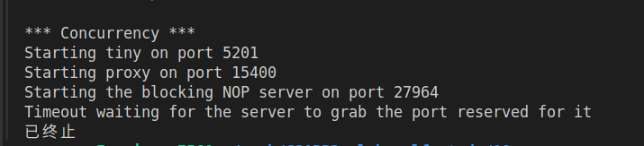

# 任务需求

写一个简单的能够缓存网络对象的HTTP代理服务器，。

- part1: 建立代理服务器，用于接收连接，读和解析请求，并转发请求到目标服务器，读并将目标服务器的响应转发给客户端。这个part包含学习基础HTTP操作和如何使用sockets来建立网络连接。
- part2: 升级代理以处理多个并发连接。这将向您介绍如何处理并发，这是一个关键的系统概念。
- part3: 将使用最近访问的简单主内存缓存将缓存添加到您的代理Web 内容。


## internet connection

- 套接字是什么？
  从程序来看是一个有相应描述符的打开文件
- 一个连接和套接字的关系？
- 套接字接口常用的有哪些？
  connect: client connects to server
  bind: 告诉内核将addr中的服务器套接字地址和套接字描述符sockfd联系起来
  listen: 服务器监听来自客户端的连接请求
  accept: 服务器等待来自客户端的连接请求
- 监听描述符和已连接描述符的区别？
- getaddrinfo 将一串字符串转化为套接字地址结构
- getnameinfo 将套接字地址转换为主机和服务名字符串
- open_clientfd 客户端调用这个建立与服务器的连接
- open_listenfd 服务器调用来创建一个监听描述符，准备好连接请求

## autograding

```unix
make 

./driver.sh
```

# partI - 实现顺序网络代理

> 实现一个基础的顺序代理，能够**处理HTTP/1.0 GET 请求**。启动时，您的代理应在命令行指定的端口上监听传入的连接。一旦建立连接，您的代理应从客户端读取整个请求并解析请求。它应确定客户端是否发送了有效的HTTP请求；如果是，则可以建立与适当Web服务器的连接，然后请求客户端指定的对象。最后，您的代理应读取服务器的响应并将其转发给客户端。
>
> tiny和proxy比较查看自己实现的是否正确

## 基础知识

- HTTP请求长啥样？
  - request line `method URI verison`
  - request header `header-name: header-data`
- URI和URL的区别？
  https://zhuanlan.zhihu.com/p/38120321
  URL(uniform resource locator)：它是对可以从互联网上得到的资源的位置和访问方法的一种简洁的表示，是互联网上标准资源的地址。
  - URL的格式一般由下列三部分组成：
    1. 协议(或称为服务方式);
    2. 存有该资源所在的服务器的名称或IP地址(包括端口号);
    3. 主机资源的具体地址。
  e.g. URL:  http://127.0.0.1:8080/webProject/index.html 

  URI(uniform resource identifier)： 用来标识抽象或物理资源。Web上可用的每种资源（ HTML文档、图像、音频、视频片段、程序等）都由一个通用资源标识符（Uniform Resource Identifier, 简称”URI”）进行定位。
  - URI的格式也由三部分组成：
    1. 访问资源的命名机制。
    2. 存放资源的主机名。
    3. 资源自身的名称，由路径表示。

  URN：Uniform Resource Name，统一资源名称。

  > URL 一定是 URI
  > URN + URL 就是 URI

- HTTP post组成？
  - response line `verison status-code status message`
  - response header `header-name: header-data`
- 怎么解析HTTP request?
  将request解析为hostname + path / query
- proxy请求是以 HTTP /1.0 结尾，所以如果接收到的是HTTP /1.0那么需要修改
- rio是啥？
  robust IO 函数包

## 代理器处理过程

1. 处理器发送HTTP GET 请求给代理器:
   `GET http://www.cmu.edu/hub/index.html HTTP/1.1`
   - GET 请求method
   - host name: http://www.cmu.edu
   - 请求资源路径：/hub/index.html
   - HTTP 版本是1.1
2. proxy解析请求，得到hostname + path / query，然后打开一个连接到host，并且发送HTTP request。代理转发请求行如下，以'\r\n'结尾：
   `GET /hub/index.html HTTP/1.0`
   **notice: HTTP /1.1 需要变为HTTP /1.0，代理器才能转发**
3. 还有一些重要的请求头，如：
   [required] `Host: www.cmu.edu`
   [optional] `User-Agent: Mozilla/5.0 (X11; Linux x86_64; rv:10.0.12) Gecko/20100101 Firefox/10.0.12`
   [required] `Connection: close`
   [required] `Proxy-Connection: close`
   
## debug

可以先直接访问tiny server，看看正确的结果是什么样


1. 选择可以用的端口

```unix
./port-for-user.pl droh

droh:45806
```

2. 开一个终端，启动tiny服务器

``unix
./tiny 45806

```

3. 开另一终端做client端，通过curl访问tiny服务器上home.html

```unix
curl -v http://localhost:45806 http://localhost:45806/home.html
```

client端结果:

```bash
$ curl -v http://localhost:45806 http://localhost:45806/home.html
* Host localhost:45806 was resolved.
* IPv6: ::1
* IPv4: 127.0.0.1
*   Trying [::1]:45806...
* connect to ::1 port 45806 from ::1 port 58380 failed: Connection refused
*   Trying 127.0.0.1:45806...
* Connected to localhost (127.0.0.1) port 45806
* using HTTP/1.x
> GET / HTTP/1.1
> Host: localhost:45806
> User-Agent: curl/8.15.0
> Accept: */*
> 
* Request completely sent off
* HTTP 1.0, assume close after body
< HTTP/1.0 200 OK
< Server: Tiny Web Server
< Content-length: 120
< Content-type: text/html
< 
<html>
<head><title>test</title></head>
<body> 

Dave O'Hallaron
</body>
</html>
* shutting down connection #0
* Hostname localhost was found in DNS cache
*   Trying [::1]:45806...
* connect to ::1 port 45806 from ::1 port 58382 failed: Connection refused
*   Trying 127.0.0.1:45806...
* Connected to localhost (127.0.0.1) port 45806
* using HTTP/1.x
> GET /home.html HTTP/1.1
> Host: localhost:45806
> User-Agent: curl/8.15.0
> Accept: */*
> 
* Request completely sent off
* HTTP 1.0, assume close after body
< HTTP/1.0 200 OK
< Server: Tiny Web Server
< Content-length: 120
< Content-type: text/html
< 
<html>
<head><title>test</title></head>
<body> 

Dave O'Hallaron
</body>
</html>
* shutting down connection #1
```

tiny server端结果：

```bash
Accepted connection from (localhost, 43354)
GET /home.html HTTP/1.1
Host: localhost:45806
User-Agent: curl/8.15.0
Accept: */*
```

> 使用代理服务器的结果应该要和上面一样
> 需要一个终端运行tiny server，另一个终端再运行proxy，然后通过curl发送请求给proxy server,让proxy server转发请求给tiny server


## 关键实现

### 解析uri

```c
void parse_uri(char* str, url_t* url)
{
    /* 解析str的信息，填充到url中，包括hostname + port + path
     e.g. str = "http://127.0.0.1:8080/webProject/index.html"
     url->host = 127.0.0.1
     url->port = 8080
     url->path = /webProject/index.html
     解析顺序是从后往前解析的， path -> port -> host
    */
    // get the first place of '//'
    char* ptr = strstr(str, "//");

    if (ptr == NULL) {
        printf("No host found\r\n");
        return;
    }
    str = ptr + 2;   // 指向"//"后面的字符

    ptr = strchr(str, '/');   // 指向：第一次出现的位置
    if (ptr == NULL) {
        printf("No host found again\r\n");
        return;
    }
    strcpy(url->path, ptr);
    *ptr = '\0';   // 截断str

    ptr = strchr(str, ':');
    if (ptr == NULL) {
        printf("use default port 80\r\n");
        strcpy(url->port, "80");
    }
    else {
        strcpy(url->port, ptr + 1);
        *ptr = '\0';   // 截断port
    }

    strcpy(url->host, str);
}
```

### 生成转发给server的请求

```c
void gen_forward_msg(char* data, url_t* url, rio_t* rio)
{
    /*
     根据url和rio，生成要转发的message，放在data中
    */
    char tmp[MAXLINE], getLine[MAXLINE], hostLine[MAXLINE];
    char userAgentLine[MAXLINE], connectionLine[MAXLINE], proxyConnectionLine[MAXLINE];

    // step1: 将转发信息的每一行进行单独组装
    sprintf(getLine, "GET %s HTTP/1.0\r\n", url->path);
    sprintf(hostLine, "Host: %s\r\n", url->host);
    sprintf(userAgentLine, "User-Agent: %s", user_agent_hdr);
    sprintf(connectionLine, "Connection: close\r\n");
    sprintf(proxyConnectionLine, "Proxy-Connection: close\r\n");

    // step2: 将每一行信息依次写到data中
    char* ptr = data;
    int   len;

    len = snprintf(ptr, data + MAXLINE - ptr, "%s", getLine);
    ptr += len;
    len = snprintf(ptr, data + MAXLINE - ptr, "%s", hostLine);
    ptr += len;
    len = snprintf(ptr, data + MAXLINE - ptr, "%s", userAgentLine);
    ptr += len;
    len = snprintf(ptr, data + MAXLINE - ptr, "%s", connectionLine);
    ptr += len;
    len = snprintf(ptr, data + MAXLINE - ptr, "%s", proxyConnectionLine);
    ptr += len;

    // step3: 读取rio中的额外数据（剔除前面已经生成好的），并写入data中
    Rio_readlineb(rio, tmp, MAXLINE);
    while (strcmp(tmp, "\r\n")) {
        if (!strncasecmp(tmp, "Host", strlen("Host")) ||
            !strncasecmp(tmp, "User-Agent", strlen("User-Agent")) ||
            !strncasecmp(tmp, "Connection", strlen("Connection")) ||
            !strncasecmp(tmp, "Proxy-Connection", strlen("Proxy-Connection"))) {
            if (Rio_readlineb(rio, tmp, MAXLINE) <= 0) break;
            continue;
        }
        sprintf(ptr, tmp);
        ptr += strlen(tmp);
        if (Rio_readlineb(rio, tmp, MAXLINE) <= 0) break;
    }

    // step4: 最后要加上换行！
    sprintf(ptr, "\r\n");
}
```

## 最终运行结果

```bash
$ ./driver.sh 
*** Basic ***
Starting tiny on 3687
Starting proxy on 7419
1: home.html
   Fetching ./tiny/home.html into ./.proxy using the proxy
   Fetching ./tiny/home.html into ./.noproxy directly from Tiny
   Comparing the two files
   Success: Files are identical.
2: csapp.c
   Fetching ./tiny/csapp.c into ./.proxy using the proxy
   Fetching ./tiny/csapp.c into ./.noproxy directly from Tiny
   Comparing the two files
   Success: Files are identical.
3: tiny.c
   Fetching ./tiny/tiny.c into ./.proxy using the proxy
   Fetching ./tiny/tiny.c into ./.noproxy directly from Tiny
   Comparing the two files
   Success: Files are identical.
4: godzilla.jpg
   Fetching ./tiny/godzilla.jpg into ./.proxy using the proxy
   Fetching ./tiny/godzilla.jpg into ./.noproxy directly from Tiny
   Comparing the two files
   Success: Files are identical.
5: tiny
   Fetching ./tiny/tiny into ./.proxy using the proxy
   Fetching ./tiny/tiny into ./.noproxy directly from Tiny
   Comparing the two files
   Success: Files are identical.
Killing tiny and proxy
basicScore: 40/40

*** Concurrency ***
Starting tiny on port 3922
Starting proxy on port 9476
Starting the blocking NOP server on port 2396
Timeout waiting for the server to grab the port reserved for it
已终止
```

# partII - 处理多个并发请求

> 实现并发服务器的最简单方法是生成一个新线程来处理每个新连接请求。
> 其他设计也是可能的,例如在第 12.5.5 节中描述的预线程服务器。
> 注意：
> - 您的线程应该以分离模式运行,以避免内存泄漏。
> - CS:APP3e 教科书中描述的 open clientfd 和 open listengfd 函数是基于现代协议独立的 getaddrinfo 函数,因此线程安全。
> 阅读第12章并发编程的内容


如何构造一个并发服务器？
- 父进程接收客户端的连接请求，并创建子进程处理每个请求
- IO多路复用
- **多线程**

**参考page709 实现并发服务器**，其中sbuf可以用copy 这里的文件[sbuf.h](https://csapp.cs.cmu.edu/3e/ics3/code/conc/sbuf.h) + [sbuf.c](https://csapp.cs.cmu.edu/3e/ics3/code/conc/sbuf.c)

makefile修改如下：
```makefile
sbuf.o: sbuf.c sbuf.h
	$(CC) $(CFLAGS) -c sbuf.c

proxy: proxy.o csapp.o sbuf.o
	$(CC) $(CFLAGS) proxy.o csapp.o sbuf.o -o proxy $(LDFLAGS)

```
## 关键实现

```c

void* thread(void* vargp);

#define NTHREADS 4    // 最大线程数
#define SBUFSIZE 16   // 缓冲区大小

sbuf_t sbuf;   // 连接描述符缓冲区

int main(int argc, char** argv)
{
    int                     listenfd, connfd;
    char                    hostname[MAXLINE], port[MAXLINE];
    socklen_t               clientlen;
    struct sockaddr_storage clientaddr;
    pthread_t               tid;

    /* Check command line args */
    if (argc != 2) {
        fprintf(stderr, "usage: %s <port>\n", argv[0]);
        exit(1);
    }

    listenfd = Open_listenfd(argv[1]);

    sbuf_init(&sbuf, SBUFSIZE);   // 初始化缓冲区

    /* 创建工作线程 */
    for (int i = 0; i < NTHREADS; i++) {
        Pthread_create(&tid, NULL, thread, NULL);
    }

    while (1) {
        clientlen = sizeof(clientaddr);
        connfd    = Accept(listenfd, (SA*)&clientaddr, &clientlen);   // line:netp:tiny:accept
        Getnameinfo((SA*)&clientaddr, clientlen, hostname, MAXLINE, port, MAXLINE, 0);
        printf("Accepted connection from (%s, %s)\n", hostname, port);
        sbuf_insert(&sbuf, connfd);   // 将信号缓冲区写入文件描述符
        // doit(connfd);
        // Close(connfd);
    }

    return 0;
}

void* thread(void* vargp)
{
    Pthread_detach(Pthread_self());
    while (1) {
        int connfd = sbuf_remove(&sbuf);
        doit(connfd);
        Close(connfd);
    }
}

```


## 遇到bug



按照https://zhuanlan.zhihu.com/p/497982541 的方法，将driver.sh脚本中line 301 的`./nop-server.py`改为`python3 nop-server.py`就能解决了。

## 运行结果

```bash
*** Concurrency ***
Starting tiny on port 15063
Starting proxy on port 10878
Starting the blocking NOP server on port 24925
Trying to fetch a file from the blocking nop-server
Fetching ./tiny/home.html into ./.noproxy directly from Tiny
Fetching ./tiny/home.html into ./.proxy using the proxy
Checking whether the proxy fetch succeeded
Success: Was able to fetch tiny/home.html from the proxy.
Killing tiny, proxy, and nop-server
concurrencyScore: 15/15
```

# partIII - 缓存web对象

> 在实验的最后一部分，你需要为代理服务器添加一个缓存功能，用于在内存中存储最近使用过的 Web 对象。HTTP 协议实际上定义了一个相当复杂的模型，Web 服务器可以通过该模型给出关于其提供的对象应如何被缓存的指令，客户端也可以指定缓存应如何代表它们进行操作。不过，你的代理服务器将采用一种简化的方式。
> 
> 当你的代理服务器从服务器接收到一个 Web 对象时，它应该在将该对象传输给客户端的同时，把它缓存到内存中。如果另一个客户端从同一服务器请求同一个对象，你的代理服务器无需重新连接到该服务器，只需重新发送缓存的对象即可。
> 
> 显然，如果你的代理服务器要缓存所有曾经被请求过的对象，就需要无限量的内存。此外，由于有些 Web 对象比其他对象大，可能会出现一个巨大的对象占用整个缓存的情况，从而完全阻止其他对象被缓存。为了避免这些问题，你的代理服务器应该同时设置最大缓存大小和最大缓存对象大小。

**最大缓存大小：1 MB**

**最大缓存对象大小：100 KB**